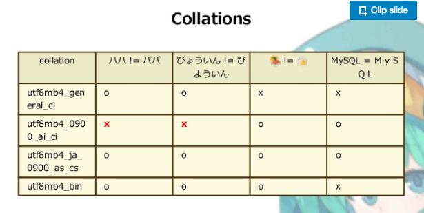
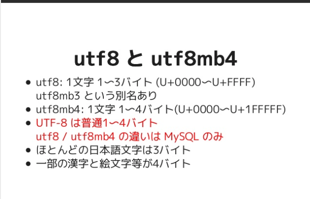
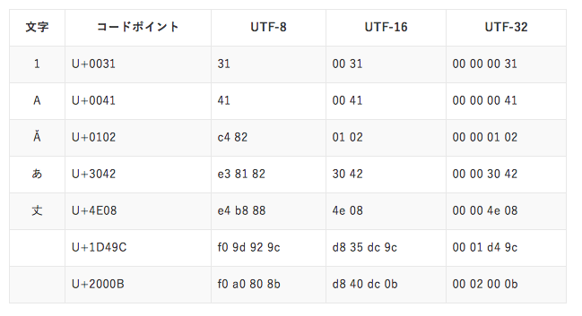

## MySQL5.8
* 文字コードの改良  
utf8mb4  
* 照合順序  
  * 日本語用照合順序  
  utf8mb4_ja_0900_as_cs  
  ut8mb4_ja_0900_as_cs_ks  
  [参考](https://www.slideshare.net/yoku0825/mysql-80)
    
    * ja  
    日本語用  
    * as:アクセントセンシティブ  
    清音濁音半濁音を区別  
    * cs:ケースセンシティブ  
    大文字・小文字を区別  
    * ks:カナセンシティブ  
    平仮名とカタカナを区別  
  * 結局...  
  ut8mb4_ja_0900_as_cs_ks  
  →清音濁音半濁音、大文字小文字、平仮名とカタカナを区別
* utf8mb4
  絵文字(4バイト文字)を取り扱える！  
  MySQL 5.5以上で対応  
  utf8とutf8mb4の違いは、MySQLのみという話も。。
  [参考](https://www.slideshare.net/tmtm/mysql-2017)
  

  U+0000 ~ U+FFFF
  U+0000 ~ U+1FFFFF

## 文字コード  
### コードポイント  
コードポイントと、各符号化方式で符号化したデータの比較  
[参考](http://www.go-next.co.jp/blog/web/php/25499/)

